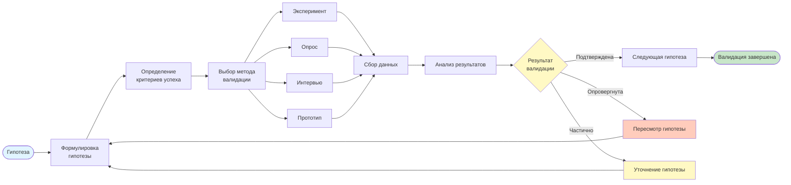
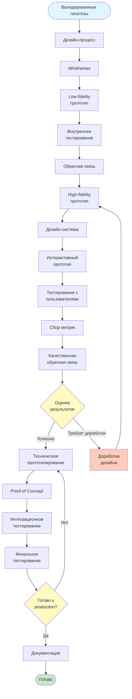
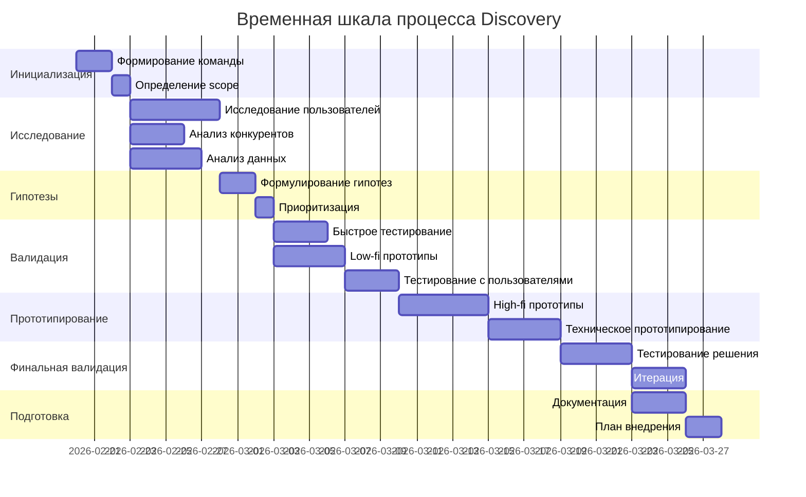
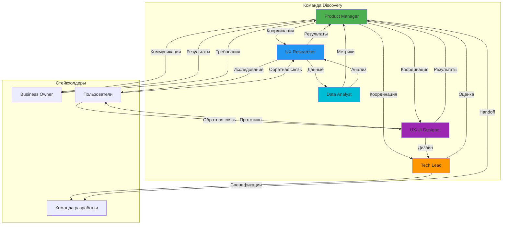

# Блок-схемы процесса Discovery

## Основной процесс Discovery

```mermaid
flowchart TD
    Start([Инициатива после PI Planning<br/>с понятными ценностями]) --> Init[Инициализация Discovery]
    
    Init --> Team[Формирование команды]
    Init --> Scope[Определение scope и сроков]
    Init --> Tools[Настройка инструментов]
    
    Team --> Research[Исследование проблемы]
    Scope --> Research
    Tools --> Research
    
    Research --> UserResearch[Исследование пользователей]
    Research --> Competitor[Анализ конкурентов]
    Research --> Data[Анализ данных и метрик]
    
    UserResearch --> Hypotheses[Формулирование гипотез]
    Competitor --> Hypotheses
    Data --> Hypotheses
    
    Hypotheses --> Prioritize[Приоритизация гипотез]
    Prioritize --> Validate[Валидация гипотез]
    
    Validate --> QuickTest[Быстрое тестирование]
    QuickTest --> LowFi[Low-fidelity прототипы]
    LowFi --> UserTest1[Тестирование с пользователями]
    
    UserTest1 --> Decision{Гипотеза<br/>валидирована?}
    
    Decision -->|Нет| Pivot[Пивот/Итерация]
    Pivot --> Hypotheses
    
    Decision -->|Да| Prototype[Прототипирование решения]
    
    Prototype --> HighFi[High-fidelity прототипы]
    HighFi --> TechProto[Техническое прототипирование]
    TechProto --> MVPCheck{Готовый продукт<br/>или MVP?}
    
    MVPCheck -->|Да| MVPTest[Тестирование MVP<br/>на 10% пользователей]
    MVPCheck -->|Нет| ValidateSolution[Валидация решения]
    
    MVPTest --> MVPMetrics[Измерение метрик<br/>MVP на части аудитории]
    MVPMetrics --> MVPSuccess{MVP<br/>успешен?}
    
    MVPSuccess -->|Нет| IterateMVP[Итерация MVP]
    IterateMVP --> MVPTest
    
    MVPSuccess -->|Да| ScaleInfra[Масштабирование<br/>инфраструктуры]
    
    ScaleInfra --> ScalePlan[Планирование масштабирования<br/>для 100% нагрузки]
    ScalePlan --> ScaleResources[Увеличение ресурсов<br/>и пропускной способности]
    ScaleResources --> ScaleMonitor[Настройка мониторинга<br/>и алертинга]
    ScaleMonitor --> LoadTest[Нагрузочное<br/>тестирование]
    LoadTest --> DeployMVP[Развертывание<br/>в Production]
    
    ValidateSolution --> UserTest2[Тестирование с пользователями]
    UserTest2 --> Metrics[Измерение метрик]
    Metrics --> Feedback[Сбор обратной связи]
    
    Feedback --> Ready{Решение<br/>готово?}
    
    Ready -->|Нет| Iterate[Итерация прототипа]
    Iterate --> Prototype
    
    Ready -->|Да| Prepare[Подготовка к развертыванию]
    
    Prepare --> Doc[Документация]
    Prepare --> Estimate[Оценка сложности]
    Prepare --> Roadmap[План внедрения]
    
    Doc --> Handoff[Передача в команду<br/>разработки]
    Estimate --> Handoff
    Roadmap --> Handoff
    
    Handoff --> Dev[Разработка решения]
    Dev --> DeployStandard[Развертывание<br/>в Production]
    
    DeployMVP --> Rollout[Постепенный запуск:<br/>25% → 50% → 100%]
    DeployStandard --> Rollout
    
    Rollout --> Monitor[Мониторинг и<br/>стабилизация]
    Monitor --> Operations[Эксплуатация]
    
    Operations --> End([Решение работает<br/>в Production])
    
    style Start fill:#e1f5ff
    style End fill:#c8e6c9
    style Decision fill:#fff9c4
    style Ready fill:#fff9c4
    style MVPCheck fill:#fff9c4
    style MVPSuccess fill:#fff9c4
    style Pivot fill:#ffccbc
    style Iterate fill:#ffccbc
    style IterateMVP fill:#ffccbc
    style MVPTest fill:#e1bee7
    style ScaleInfra fill:#c5e1a5
    style DeployMVP fill:#81c784
    style DeployStandard fill:#81c784
    style Rollout fill:#a5d6a7
    style Operations fill:#66bb6a
```

## Детальный процесс валидации гипотез

## Процесс прототипирования и тестирования

## Временная шкала процесса Discovery

## Роли и взаимодействие

## Процесс масштабирования MVP в Production

```mermaid
flowchart TD
    Start([MVP успешно протестирован<br/>на 10% пользователей]) --> Analyze[Анализ результатов<br/>тестирования]
    
    Analyze --> Metrics[Оценка метрик:<br/>- Производительность<br/>- Пользовательский опыт<br/>- Бизнес-метрики]
    
    Metrics --> Decision{Метрики<br/>успешны?}
    
    Decision -->|Нет| Iterate[Итерация MVP]
    Iterate --> Start
    
    Decision -->|Да| PlanScale[Планирование<br/>масштабирования]
    
    PlanScale --> Capacity[Расчет требуемой<br/>мощности для 100%]
    Capacity --> InfraPlan[План инфраструктуры:<br/>- Вычислительные ресурсы<br/>- Пропускная способность<br/>- Хранилище данных]
    
    InfraPlan --> ScaleResources[Масштабирование ресурсов:<br/>- Увеличение серверов<br/>- Настройка балансировщиков<br/>- Расширение БД]
    
    ScaleResources --> Monitoring[Настройка мониторинга:<br/>- Метрики производительности<br/>- Алертинг<br/>- Логирование]
    
    Monitoring --> DeployProcess[Подготовка процессов:<br/>- Развертывание<br/>- Откат изменений<br/>- Резервное копирование]
    
    DeployProcess --> LoadTest[Нагрузочное тестирование:<br/>- Тест на 100% нагрузке<br/>- Стресс-тестирование<br/>- Проверка отказоустойчивости]
    
    LoadTest --> LoadResult{Тесты<br/>пройдены?}
    
    LoadResult -->|Нет| FixIssues[Исправление проблем]
    FixIssues --> ScaleResources
    
    LoadResult -->|Да| Rollout[Постепенный запуск:<br/>- 25% пользователей<br/>- 50% пользователей<br/>- 100% пользователей]
    
    Rollout --> Monitor[Мониторинг развертывания]
    Monitor --> Stable{Стабильно<br/>работает?}
    
    Stable -->|Нет| Rollback[Откат изменений]
    Rollback --> PlanScale
    
    Stable -->|Да| DeployComplete[Развертывание<br/>завершено]
    
    DeployComplete --> Operations[Эксплуатация:<br/>- Непрерывный мониторинг<br/>- Сбор обратной связи<br/>- Анализ метрик<br/>- Поддержка системы]
    
    Operations --> Success([Решение работает<br/>в Production])
    
    style Start fill:#e1f5ff
    style Success fill:#c8e6c9
    style Decision fill:#fff9c4
    style LoadResult fill:#fff9c4
    style Stable fill:#fff9c4
    style Iterate fill:#ffccbc
    style FixIssues fill:#ffccbc
    style Rollback fill:#ffccbc
    style ScaleResources fill:#c5e1a5
    style Rollout fill:#81c784
    style DeployComplete fill:#a5d6a7
    style Operations fill:#66bb6a
```

